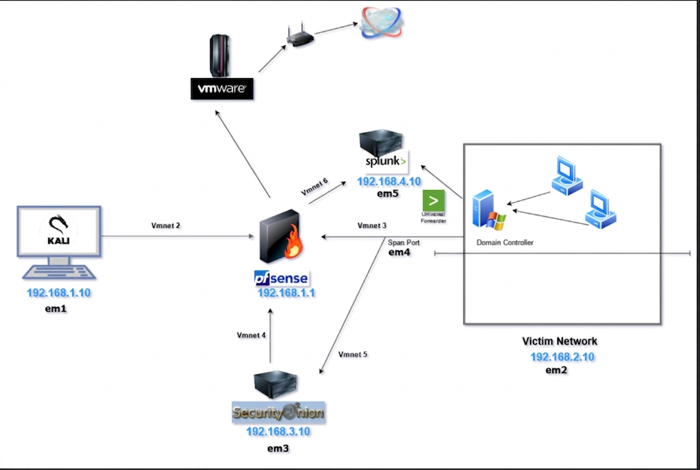

# Cybersecurity Homelab — Detection & Monitoring

A virtualized SOC environment built to practice threat detection, log analysis, and incident response across network and endpoint layers.

---

## Stack

| Layer | Tool |
|-------|------|
| Firewall & Routing | pfSense |
| Intrusion Detection | Security Onion |
| Endpoint Telemetry | Sysmon (SwiftOnSecurity config) |
| SIEM | Splunk Enterprise |
| Identity & Access | Active Directory (Windows Server 2019) |
| Attack Simulation | Kali Linux |

---

## Data Sources Ingested

- **Sysmon** — Process creation, network connections, file events (all Windows machines)
- **Windows Event Logs** — Authentication, privilege use, account management
- **pfSense Syslog** — Firewall allow/deny, DNS, DHCP
- **PowerShell Script Block Logging** — Command execution visibility

---

## Detection Coverage

| Tactic | What's Monitored |
|--------|-----------------|
| Initial Access | Firewall blocks, suspicious inbound connections |
| Execution | Process creation (Sysmon EID 1), PowerShell logging |
| Credential Access | Failed logins (EID 4625), privilege escalation (EID 4672) |
| Lateral Movement | Remote process execution, abnormal authentication |
| Command & Control | Outbound connections to anomalous destinations |

---

## Skills Demonstrated

- Network segmentation and firewall rule management
- Endpoint detection engineering with Sysmon
- Log ingestion, parsing, and indexing in Splunk
- Active Directory administration and attack surface awareness
- Threat simulation and detection validation

---
