# Cybersecurity Homelab — Detection & Monitoring

A virtualized SOC environment built on Pop OS using VMware Workstation, simulating a corporate Active Directory environment with full network segmentation, intrusion detection, and SIEM integration. This lab covers the full SOC workflow: attack simulation → log ingestion → detection → investigation.

---

## Architecture

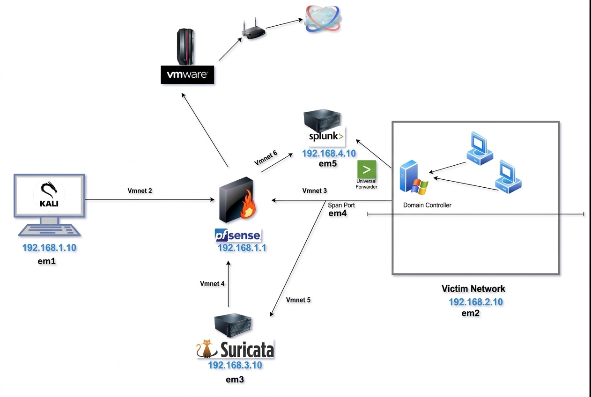

---

## Stack

| Layer | Tool |
|-------|------|
| Hypervisor | VMware Workstation (Pop OS Host) |
| Firewall & Routing | pfSense 2.6.0 |
| Network Intrusion Detection | Suricata 8.0.4 |
| Endpoint Telemetry | Sysmon (SwiftOnSecurity config) |
| SIEM | Splunk Enterprise |
| Identity & Access | Active Directory (Windows Server 2019) |
| Attack Simulation | Kali Linux + Atomic Red Team |

---

## Network Architecture

| Network | Subnet | Interface | Purpose |
|---------|--------|-----------|---------|
| KALI | 192.168.1.0/24 | em1 | Attack machine isolation |
| VICTIMNET | 192.168.2.0/24 | em2 | Domain Controller + endpoints |
| SEC | 192.168.3.0/24 | em3 | Security monitoring (Suricata) |
| SPANPORT | — | em4 | Traffic mirroring |
| SPLUNK | 192.168.4.0/24 | em5 | SIEM isolation |

---

## Data Sources Ingested

| Source | Data | Splunk Index |
|--------|------|--------------|
| Suricata IDS | Network alerts, flow data, DNS, SMB, HTTP | suricata |
| Sysmon (EID 1,3,7,10,11) | Process creation, network connections, file events | wineventlog |
| Windows Security Logs | Authentication, privilege use, account management | wineventlog |
| Windows System/Application | Service events, application errors | wineventlog |
| pfSense Syslog | Firewall allow/deny, DNS queries, DHCP leases | pfsense |

---

## Log Ingestion Setup

### pfSense Syslog → Splunk
- pfSense configured to forward syslog to Splunk UDP port 514
- Covers firewall allow/deny rules, interface traffic, DNS and DHCP activity

### Sysmon → Splunk
- Sysmon installed on Windows DC using SwiftOnSecurity config
- Splunk Universal Forwarder monitors `Microsoft-Windows-Sysmon/Operational`
- Forwards to Splunk indexer at `192.168.4.10:9997`

### Windows Event Logs → Splunk
- Security, System, and Application logs forwarded via Universal Forwarder
- Covers EventIDs: 4624, 4625, 4634, 4672, 4688, 4720, 4732

### Suricata → Splunk
Suricata deployed on the monitoring network to inspect mirrored traffic
Logs generated in EVE JSON format (/var/log/suricata/eve.json)

Log Forwarding:
Splunk Universal Forwarder installed on the Suricata VM
Monitors the EVE log file:

/var/log/suricata/eve.json
- Logs forwarded to Splunk indexer at:
- 192.168.4.10:9997


---

## Attack Scenarios & Detection

###  Kali Linux Attack Chain

#### Phase 1 — Reconnaissance

**Tools:** Nmap
```bash
sudo nmap -sn 192.168.2.0/24
sudo nmap -sS -sV -A -T4 192.168.2.10
sudo nmap -O 192.168.2.10
```

**OS Detection:**

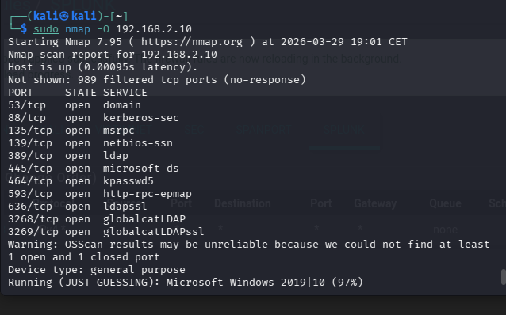

**Port & Services Scan:**

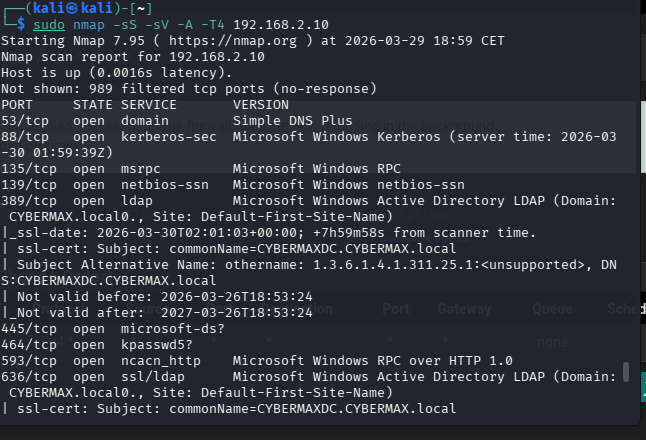

**Detected in Splunk:**

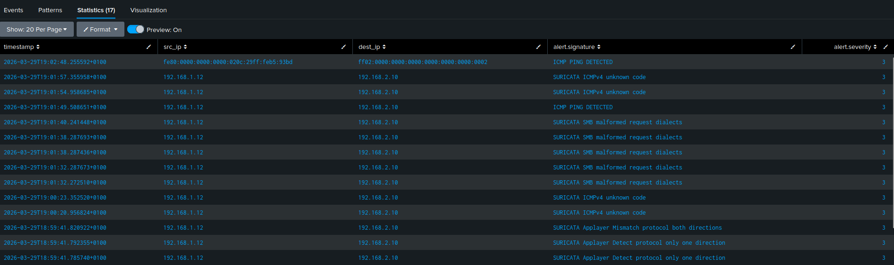

**Splunk Query:**
```
index=suricata event_type=alert | table timestamp src_ip dest_ip alert.signature
```

**MITRE:** T1595 - Active Scanning, T1046 - Network Service Scanning

---

#### Phase 2 — Enumeration

**Tools:** Nmap SMB scripts, CrackMapExec
```bash
sudo nmap --script=smb-enum-shares,smb-enum-users -p 445 192.168.2.10
crackmapexec smb 192.168.2.10 --users --shares
```

**CrackMapExec AD Enumeration:**

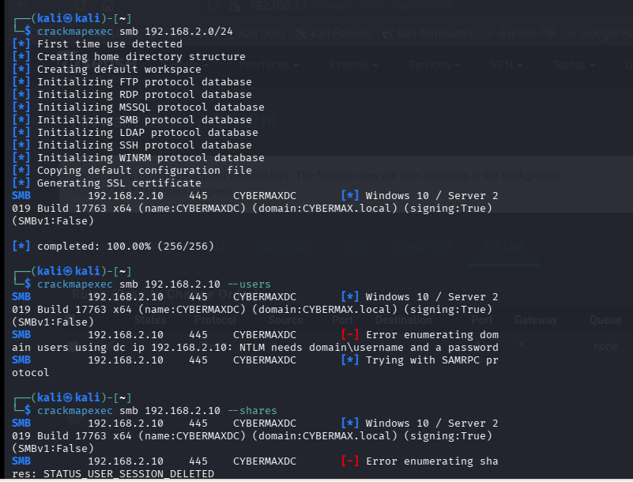

**Detected in Splunk (SMB alerts):**

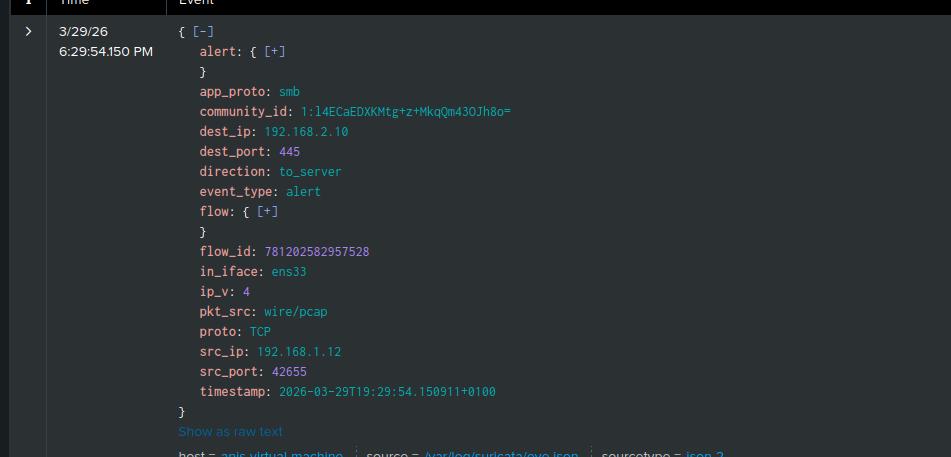

**Splunk Query:**
```
index=suricata event_type=alert app_proto=smb | table timestamp src_ip dest_ip alert.signature
```

**MITRE:** T1135 - Network Share Discovery, T1087 - Account Discovery

---

#### Phase 3 — Credential Attack (NTLM Brute Force)

**Tools:** Hydra, Metasploit smb_login, CrackMapExec password spray

**Hydra Brute Force:**

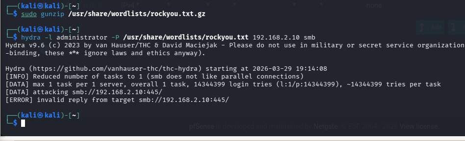

**Password Spray:**

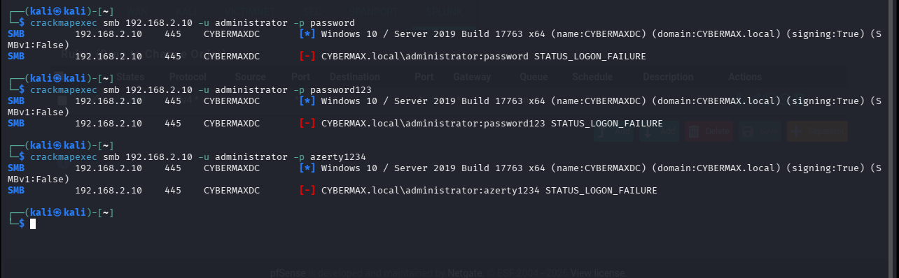

**Metasploit SMB Login:**

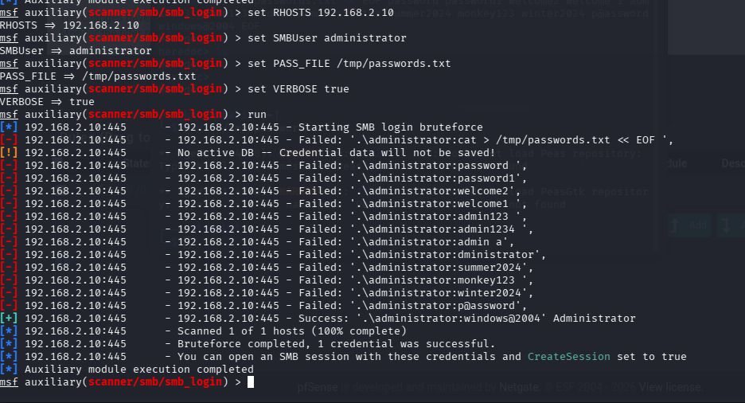

**Detected in Splunk:**

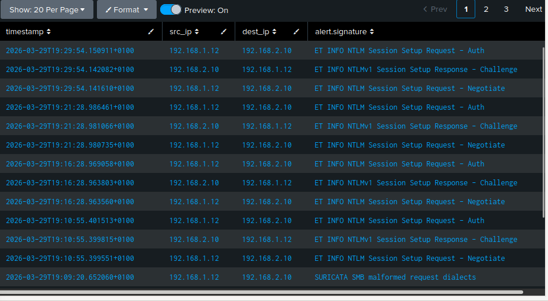

**Splunk Queries:**
```
index=suricata event_type=alert app_proto=smb | table timestamp src_ip dest_ip alert.signature direction
index=wineventlog EventCode=4625 | stats count by src_ip user | sort -count
```

**MITRE:** T1110 - Brute Force, T1557 - Adversary in the Middle

---

###  Atomic Red Team — MITRE ATT&CK Simulation

Atomic Red Team installed on Windows DC via `Invoke-AtomicRedTeam`. Each test simulates a real adversary technique mapped to MITRE ATT&CK and validates detection in Splunk via Sysmon telemetry.

#### T1057 — Process Discovery
```powershell
Invoke-AtomicTest T1057
```
**Processes Detected:** `whoami`, `hostname`, `tasklist`, `wmic process get`, `Get-Process`, `Taskmgr.exe`

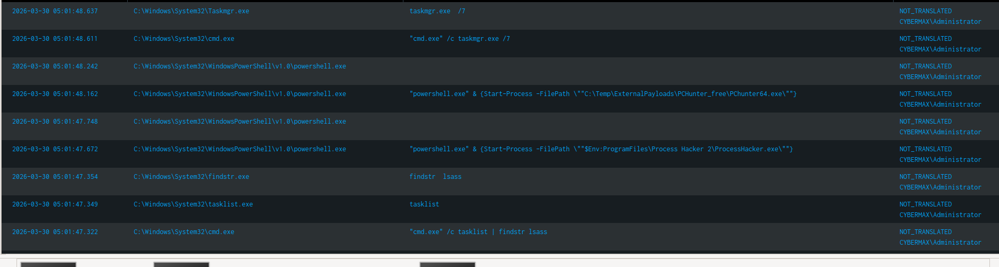

---

#### T1087.001 — Account Discovery + T1059.001 PowerShell + T1003.001 Credential Dumping
```powershell
Invoke-AtomicTest T1087.001
Invoke-AtomicTest T1059.001
Invoke-AtomicTest T1003.001
```

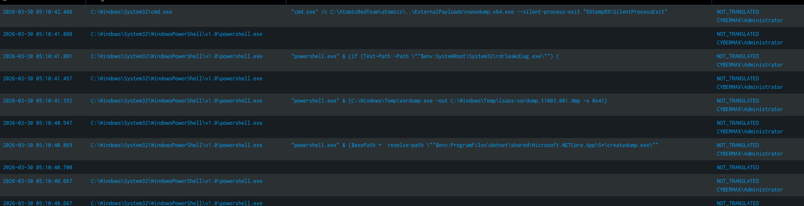

---

#### Additional Atomic Red Team Results

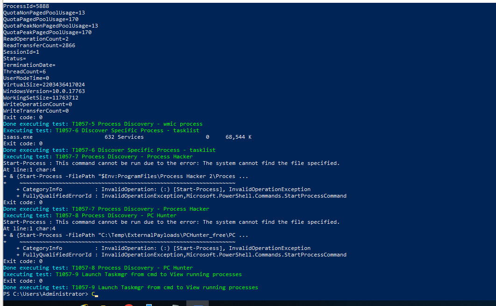

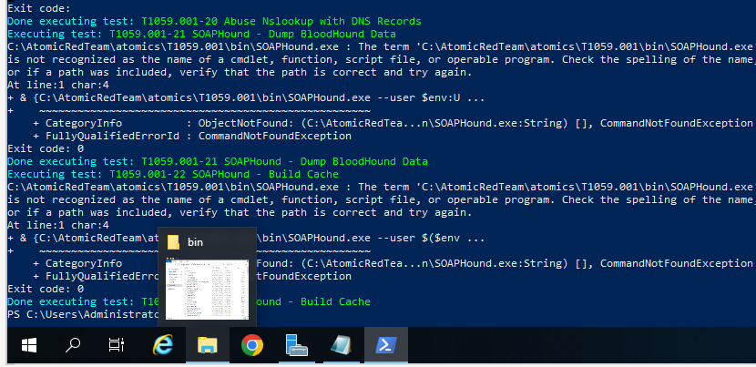

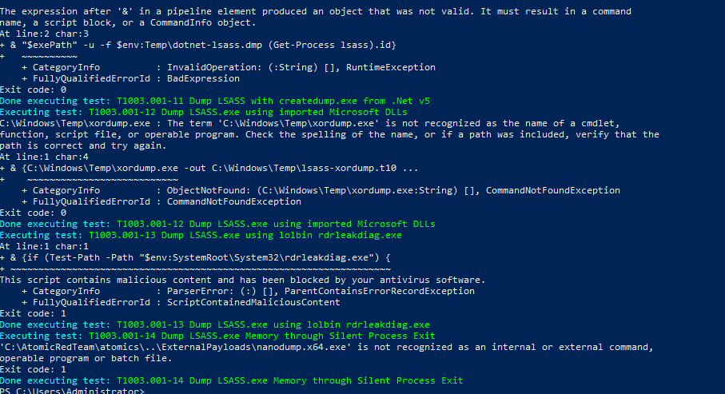

**Splunk Query used for all Atomic tests:**
```
index=wineventlog source="WinEventLog:Microsoft-Windows-Sysmon/Operational"
| rex field=_raw "<Image>(?<Image>[^<]+)</Image>"
| rex field=_raw "<CommandLine>(?<CommandLine>[^<]+)</CommandLine>"
| rex field=_raw "<User>(?<User>[^<]+)</User>"
| where NOT match(Image, "splunk")
| table _time Image CommandLine User
| sort -_time
```

---

## MITRE ATT&CK Coverage

| Phase | Technique ID | Technique | Tool | Detected |
|-------|-------------|-----------|------|----------|
| Reconnaissance | T1595 | Active Scanning | Nmap | Suricata |
| Reconnaissance | T1046 | Network Service Scanning | Nmap |  Suricata |
| Enumeration | T1135 | Network Share Discovery | CrackMapExec |  Suricata |
| Enumeration | T1087 | Account Discovery | Nmap SMB scripts |  Suricata |
| Credential Access | T1110 | Brute Force | Hydra + Metasploit |  Suricata + EID 4625 |
| Credential Access | T1557 | Adversary in the Middle | NTLM Capture |  Suricata |
| Discovery | T1057 | Process Discovery | Atomic Red Team |  Sysmon EID 1 |
| Discovery | T1087.001 | Local Account Discovery | Atomic Red Team |  Sysmon EID 1 |
| Execution | T1059.001 | PowerShell | Atomic Red Team |  Sysmon EID 1 |
| Credential Access | T1003.001 | LSASS Dump | Atomic Red Team |  Sysmon EID 10 |

---

## Key Splunk Queries

**All Suricata Alerts:**
```
index=suricata event_type=alert | table timestamp src_ip dest_ip alert.signature alert.severity | sort -timestamp
```

**SMB Attack Detection:**
```
index=suricata event_type=alert app_proto=smb | table timestamp src_ip dest_ip alert.signature direction | sort -timestamp
```

**Brute Force Detection:**
```
index=wineventlog EventCode=4625 | stats count by src_ip user | sort -count
```

**Sysmon Process Creation:**
```
index=wineventlog source="WinEventLog:Microsoft-Windows-Sysmon/Operational"
| rex field=_raw "<Image>(?<Image>[^<]+)</Image>"
| rex field=_raw "<CommandLine>(?<CommandLine>[^<]+)</CommandLine>"
| where NOT match(Image, "splunk")
| table _time Image CommandLine User
| sort -_time
```

**Full Attack Timeline:**
```
index=suricata OR index=wineventlog (EventCode=4625 OR EventCode=4624 OR event_type=alert)
| table _time src_ip dest_ip alert.signature EventCode user
| sort -_time
```


## Skills Demonstrated

- Network segmentation and VLAN design using pfSense on a Linux host
- VMware Workstation homelab design and configuration
- Suricata IDS deployment, rule management and alert tuning
- Splunk log ingestion, indexing and correlation across multiple sources
- Sysmon deployment and configuration for endpoint visibility
- pfSense syslog forwarding to Splunk for network-layer detection
- Active Directory administration and attack surface awareness
- Offensive security using Kali Linux, Hydra, and Metasploit
- MITRE ATT&CK technique simulation using Atomic Red Team
- End-to-end SOC workflow: attack simulation → detection → investigation

---

---


## Automated Detection & Response (n8n SOAR Workflow)

Created splunk alerts for different scenarios of attacks : Recon , Brute Force , process discovery .

created A SOAR workflow built in n8n connects Splunk alerting to automated response actions, reducing mean time to respond (MTTR) to near zero for known attack patterns.

### Architecture

Splunk Alert → Webhook → n8n → JavaScript (parse + classify) → SSH (pfSense block) → Discord (notify)

### Workflow Nodes

| Node | Type | Purpose |
|------|------|---------|
| Webhook | Trigger | Receives POST from Splunk alert action |
| Code in JavaScript | Transform | Parses alert payload, classifies attack type, builds Discord message |
| Execute a command | SSH | Runs pfctl command on pfSense to block attacker IP |
| HTTP Request | POST | Sends formatted alert to Discord webhook |

### Splunk Alerts Configured

Three saved searches in Splunk are configured with a webhook action pointing to the n8n instance at `192.168.3.10:5678`:

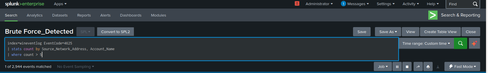 
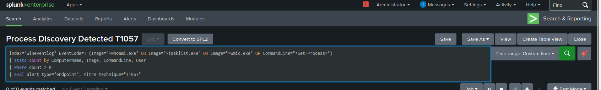
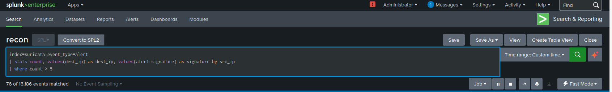


## Detection Coverage

| Tactic | Detection Method | Source |
|--------|-----------------|--------|
| Reconnaissance | ET SCAN signatures, ICMP detection | Suricata |
| Network Scanning | SMB malformed request detection | Suricata |
| Brute Force | NTLM auth attempt signatures | Suricata |
| Failed Logins | EventID 4625 threshold alerting | Windows/Splunk |
| Process Creation | Sysmon EID 1 | Sysmon/Splunk |
| Credential Dumping | Sysmon EID 10 (LSASS access) | Sysmon/Splunk |
| PowerShell Abuse | Sysmon EID 1 + script block logging | Sysmon/Splunk |
| Firewall Activity | pfSense syslog allow/deny | pfSense/Splunk |

---

### n8n Workflow

The JavaScript node classifies the incoming alert into one of three types based on the payload:

- **Network Alert** (Reconnaissance / Brute Force): extracts `src_ip`, `dest_ip`, `alert.signature`
- **Endpoint Alert** (Process Discovery): extracts `ComputerName`, `Image`, `CommandLine`

For network alerts, the workflow SSHs into pfSense and executes:
```bash
pfctl -t blocklist -T add <src_ip> && echo "<src_ip>" >> /var/db/aliastables/blocklist.txt && echo "Blocked <src_ip>"
```

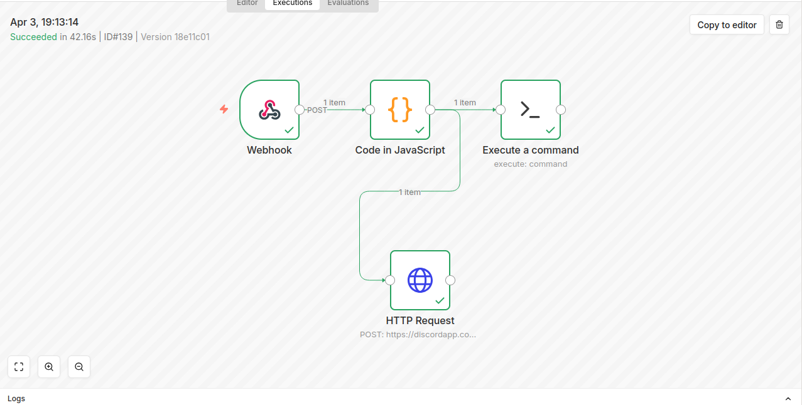

### Discord Notifications

Each alert type produces a formatted Discord message:

**Reconnaissance / Network Alert:**
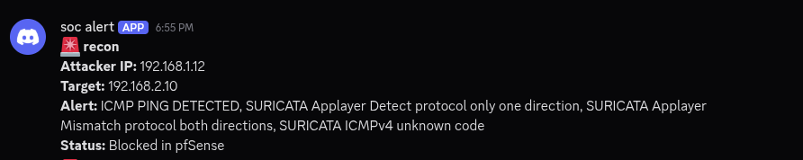

**Brute Force / Endpoint:**
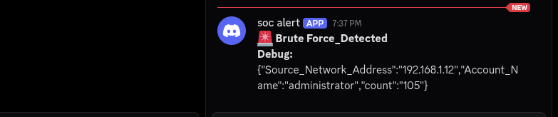

**Process Dicovery , powershell abuse / Endpoint:**
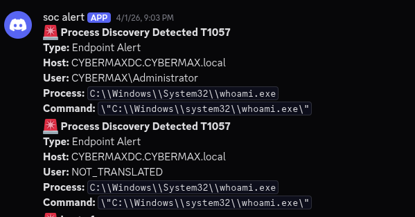


### Skills Demonstrated

- SOAR workflow design and implementation using n8n
- Webhook-based integration between Splunk and external automation
- Automated firewall response via SSH and pfctl
- Alert classification and enrichment using JavaScript
- Real-time notification pipeline to Discord
- End-to-end automated SOC response: detect → classify → block → notify


## Lessons Learned

Building this lab from scratch exposed a number of real-world challenges that significantly deepened my understanding of SOC infrastructure, network engineering, and detection engineering. The problems I ran into — and solved — taught me more than any guided tutorial would have.

---

###  Infrastructure & Networking

**VMware Host-Only Networking and Promiscuous Mode**
The single most time-consuming challenge in this lab was getting Suricata to see network traffic. VMware Workstation on Linux blocks promiscuous mode by default at the kernel level, meaning even with the correct VMnet assignments, the Suricata VM received no mirrored traffic. The fix required editing the VM's `.vmx` file directly to add `ethernet0.noPromisc = "FALSE"` and running `chmod a+rw /dev/vmnet*` on the host after every reboot. I eventually automated this with a systemd service. This mirrors a real-world challenge where network taps and SPAN ports require careful physical and logical configuration to function correctly.

**pfSense as the Network Core**
Using pfSense to segment five separate networks taught me how enterprise firewalls actually work — not just allow/deny rules but DHCP scoping per interface, inter-VLAN routing decisions, and how DNS resolution differs per network segment. A subtle but important lesson: VMware's own DHCP service was competing with pfSense and winning, assigning wrong IPs to VMs. Disabling VMware DHCP on all host-only networks and letting pfSense handle everything resolved persistent connectivity issues across the entire lab.

**IP Addressing and Routing Across Segments**
Getting the Splunk Universal Forwarder on the Windows DC to reach the Splunk server on a different subnet required understanding that pfSense must have explicit routing between VICTIMNET and the SPLUNK network. Simply having both VMs running was not enough — firewall rules had to explicitly permit the traffic flow. This is a lesson I would apply directly in a real SOC environment when troubleshooting log gaps.

---

###  Detection & Log Ingestion

**Splunk Forwarder Pointing to the Wrong IP**
After migrating the Splunk VM from NAT to a dedicated network segment, the Universal Forwarder on the Windows DC was still pointing to the old NAT IP (`172.16.5.128`). Logs appeared to be configured correctly but nothing was arriving in Splunk. The fix was straightforward once identified — removing and re-adding the forward server — but it reinforced an important SOC lesson: always verify end-to-end connectivity, not just configuration files. A misconfigured forwarder silently drops logs with no obvious alert.

**Sysmon XML Rendering vs Plain Text**
Setting `renderXml = true` in the Splunk forwarder inputs.conf caused Sysmon events to arrive as raw XML blobs rather than parsed fields. This meant standard Splunk searches like `Image=` or `CommandLine=` returned no results. The workaround was using `rex` field extractions to parse the XML inline. The permanent fix was setting `renderXml = false`. This taught me the importance of verifying that log sources are not just arriving in SIEM but arriving in a format that's actually searchable and useful for detection.

**Timezone Mismatch Between Windows DC and Splunk**
The Windows DC was operating in UTC+1 while the Splunk indexer was in UTC. This caused a consistent one-hour gap where recent events appeared to have "0 results" when searching with relative time filters. Switching Splunk searches to "All time" revealed the events immediately. The permanent fix was aligning timezones across all VMs and configuring NTP properly. In a real SOC environment, timezone misalignment across log sources is a known blind spot that can cause analysts to miss alerts during investigations.

---

###  Intrusion Detection

**Suricata Interface Configuration**
The default Suricata configuration references `eth0` across multiple sections of `suricata.yaml`. On Ubuntu 22.04 the interface is named `ens33`. Despite updating the primary `af-packet` section, other sections of the config still referenced `eth0`, causing silent failures where Suricata started but processed zero packets. Lesson: always validate the full configuration file, not just the obvious section, and use `suricata -T -c suricata.yaml -v` to test before deploying.

**SPAN Port Limitations in a Virtual Environment**
A physical SPAN port mirrors all traffic on a switch to a designated monitoring port. In VMware Workstation, replicating this behavior requires a bridge configuration in pfSense and promiscuous mode enabled at the hypervisor level. When this didn't work reliably, I pivoted to placing Suricata directly on the VICTIMNET segment, which proved more effective and simpler to maintain. The lesson here is that virtual environments sometimes require creative workarounds compared to physical infrastructure.

---

###  Attack Simulation

**Atomic Red Team and Field Parsing**
When running Atomic Red Team tests, the Sysmon events were arriving in Splunk but in raw XML format, making it impossible to filter by process name or command line using standard field names. This led me to write custom `rex` extractions to parse `Image`, `CommandLine`, and `User` fields from the raw XML. This was an unexpectedly valuable exercise — understanding how to extract fields from unparsed logs is a core skill for any SOC analyst dealing with non-standard log sources.

**Brute Force Detection Requires Baseline**
Running the Metasploit SMB login scanner initially produced alerts in Suricata but not meaningful Windows EventID 4625 entries, because the default audit policy on Windows Server doesn't always log failed network authentication attempts. Enabling the audit policy with `auditpol /set /subcategory:"Logon" /failure:enable` was required. This mirrors a real-world gap — many organizations run default Windows audit policies that are insufficient for detecting credential attacks.

---

###  General

**Documentation is Part of the Lab**
The most underestimated part of this project was documentation. Keeping track of what worked, what didn't, and why took as much time as the technical work itself. This discipline — of writing down decisions, configurations, and failures — is directly transferable to incident response work where a clear timeline and evidence trail are critical.

**Iterative Problem Solving Over Perfection**
Almost nothing worked on the first attempt. The approach that worked best was isolating one variable at a time — confirming traffic existed with `tcpdump` before debugging Suricata, confirming port connectivity with `Test-NetConnection` before debugging Splunk forwarding. This systematic methodology is exactly how SOC analysts and incident responders approach unknown problems in production environments.

## References
- [Cyberwox Academy Homelab Guide](https://blog.cyberwoxacademy.com/post/building-a-cybersecurity-homelab) check it for homelab installation + setup
- [Suricata Documentation](https://docs.suricata.io)
- [Splunk Documentation](https://docs.splunk.com)
- [MITRE ATT&CK Framework](https://attack.mitre.org)
- [SwiftOnSecurity Sysmon Config](https://github.com/SwiftOnSecurity/sysmon-config)
- [Atomic Red Team](https://github.com/redcanaryco/atomic-red-team)
- [Invoke-AtomicRedTeam](https://github.com/redcanaryco/invoke-atomicredteam)
