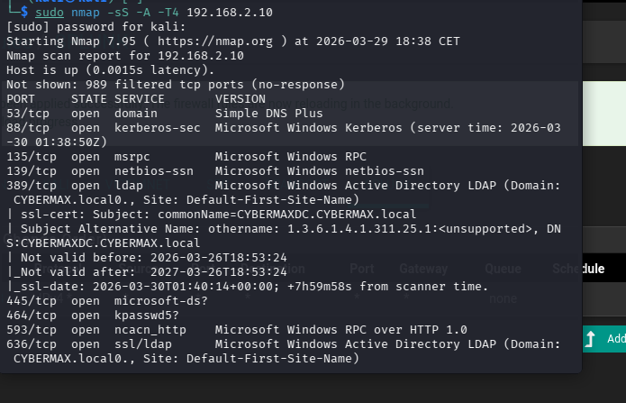

# Cybersecurity Homelab — Detection & Monitoring

A virtualized SOC environment built on Pop OS using VMware Workstation, simulating a corporate Active Directory environment with full network segmentation, intrusion detection, and SIEM integration. This lab covers the full SOC workflow: attack simulation → log ingestion → detection → investigation.

---


---

## Stack

| Layer | Tool |
|-------|------|
| Hypervisor | VMware Workstation (Pop OS Host) |
| Firewall & Routing | pfSense 2.6.0 |
| Network Intrusion Detection | Suricata 8.0.4 |
| Endpoint Telemetry | Sysmon (SwiftOnSecurity config) |
| SIEM | Splunk Enterprise |
| Identity & Access | Active Directory (Windows Server 2019) |
| Attack Simulation | Kali Linux + Atomic Red Team |

---

## Network Architecture

| Network | Subnet | Interface | Purpose |
|---------|--------|-----------|---------|
| KALI | 192.168.1.0/24 | em1 | Attack machine isolation |
| VICTIMNET | 192.168.2.0/24 | em2 | Domain Controller + endpoints |
| SEC | 192.168.3.0/24 | em3 | Security monitoring (Suricata) |
| SPANPORT | — | em4 | Traffic mirroring |
| SPLUNK | 192.168.4.0/24 | em5 | SIEM isolation |

All networks are isolated via pfSense with dedicated firewall rules per segment. pfSense acts as the DHCP server and default gateway for all internal networks.

---

## Data Sources Ingested

| Source | Data | Splunk Index |
|--------|------|--------------|
| Suricata IDS | Network alerts, flow data, DNS, SMB, HTTP | suricata |
| Sysmon (EID 1,3,7,10,11) | Process creation, network connections, file events | wineventlog |
| Windows Security Logs | Authentication, privilege use, account management | wineventlog |
| Windows System/Application | Service events, application errors | wineventlog |
| pfSense Syslog | Firewall allow/deny, DNS queries, DHCP leases | pfsense |

---

## Log Ingestion Setup

### pfSense Syslog → Splunk
- pfSense configured to forward syslog to Splunk UDP port 514
- Covers firewall allow/deny rules, interface traffic, DNS and DHCP activity
- Visible in Splunk under `index=pfsense`

### Sysmon → Splunk
- Sysmon installed on Windows DC using SwiftOnSecurity config
- Splunk Universal Forwarder installed on Windows DC
- Configured to monitor `Microsoft-Windows-Sysmon/Operational` event log
- Forwards to Splunk indexer at `192.168.4.10:9997`
- Visible in Splunk under `index=wineventlog source="WinEventLog:Microsoft-Windows-Sysmon/Operational"`

### Windows Event Logs → Splunk
- Security, System, and Application logs forwarded via Universal Forwarder
- Covers EventIDs: 4624, 4625, 4634, 4672, 4688, 4698, 4720, 4732

---

## Attack Scenarios & Detection

### 🔴 Kali Linux Attack Chain

#### Phase 1 — Reconnaissance
**Tool:** Nmap  
**Commands:**
```bash
sudo nmap -sn 192.168.2.0/24
sudo nmap -sS -sV -A -T4 192.168.2.10
sudo nmap -O 192.168.2.10

**Screenshot:** `ports&services.png`
**Screenshot:** `osDetection.png`
```
**Detected By:** Suricata  
**Signatures:** `ET SCAN`, `ICMP PING DETECTED`  
**Screenshot:** `phase1-recon-splunk.png`  
**Splunk Query:**
```
index=suricata event_type=alert | table timestamp src_ip dest_ip alert.signature
```

---

#### Phase 2 — Enumeration
**Tool:** Nmap SMB scripts, CrackMapExec  
**Commands:**
```bash
sudo nmap --script=smb-enum-shares,smb-enum-users -p 445 192.168.2.10
crackmapexec smb 192.168.2.10 --users --shares
```
**Detected By:** Suricata  
**Signatures:** `SURICATA SMB malformed request dialects`  
**Screenshot:** `screenshots/phase2-enum-splunk.png`  
**Splunk Query:**
```
index=suricata event_type=alert app_proto=smb | table timestamp src_ip dest_ip alert.signature
```

---

#### Phase 3 — Credential Attack (NTLM Brute Force)
**Tool:** Metasploit smb_login module  
**Commands:**
```bash
use auxiliary/scanner/smb/smb_login
set RHOSTS 192.168.2.10
set SMBUser administrator
set PASS_FILE /tmp/passwords.txt
run
```
**Detected By:** Suricata + Windows Event Logs  
**Signatures:**
- `ET INFO NTLM Session Setup Request - Negotiate`
- `ET INFO NTLM Session Setup Request - Auth`
- `ET INFO NTLMv1 Session Setup Response - Challenge`
- Windows EventID 4625 (Failed Logon)

**Screenshot:** `screenshots/phase3-bruteforce-splunk.png`  
**Splunk Queries:**
```
index=suricata event_type=alert app_proto=smb | table timestamp src_ip dest_ip alert.signature direction
index=wineventlog EventCode=4625 | stats count by src_ip user | sort -count
```

---

### 🔵 Atomic Red Team — MITRE ATT&CK Simulation

Atomic Red Team installed on Windows DC via `Invoke-AtomicRedTeam` module. Each test simulates a real adversary technique and validates detection capability in Splunk via Sysmon telemetry.

#### T1057 — Process Discovery
**Command:**
```powershell
Invoke-AtomicTest T1057
```
**Processes Detected:**
- `whoami.exe` — system owner discovery
- `HOSTNAME.EXE` — hostname enumeration
- `tasklist.exe` — process listing
- `WMIC.exe` — WMI process enumeration
- `powershell.exe Get-Process` — PowerShell process discovery
- `powershell.exe get-wmiObject Win32_Process` — WMI via PowerShell
- `Taskmgr.exe` — Task Manager launch

**Screenshot:** `screenshots/T1057-process-discovery-splunk.png`  
**Splunk Query:**
```
index=wineventlog source="WinEventLog:Microsoft-Windows-Sysmon/Operational"
| rex field=_raw "<Image>(?<Image>[^<]+)</Image>"
| rex field=_raw "<CommandLine>(?<CommandLine>[^<]+)</CommandLine>"
| rex field=_raw "<User>(?<User>[^<]+)</User>"
| where NOT match(Image, "splunk")
| table _time Image CommandLine User
| sort -_time
```

---

#### T1087.001 — Local Account Discovery
**Command:**
```powershell
Invoke-AtomicTest T1087.001
```
**Processes Detected:** `net.exe user`, `net1.exe`, `whoami /groups`  
**Screenshot:** `screenshots/T1087-account-discovery-splunk.png`

---

#### T1059.001 — PowerShell Execution
**Command:**
```powershell
Invoke-AtomicTest T1059.001
```
**Processes Detected:** Encoded PowerShell commands, download cradles  
**Screenshot:** `screenshots/T1059-powershell-splunk.png`

---

#### T1003.001 — LSASS Credential Dumping
**Command:**
```powershell
Invoke-AtomicTest T1003.001
```
**Processes Detected:** LSASS memory access attempts  
**Screenshot:** `screenshots/T1003-credential-dump-splunk.png`

---

## MITRE ATT&CK Coverage

| Phase | Technique ID | Technique | Tool | Detected |
|-------|-------------|-----------|------|----------|
| Reconnaissance | T1595 | Active Scanning | Nmap | ✅ Suricata |
| Reconnaissance | T1046 | Network Service Scanning | Nmap | ✅ Suricata |
| Enumeration | T1135 | Network Share Discovery | CrackMapExec | ✅ Suricata |
| Enumeration | T1087 | Account Discovery | Nmap SMB scripts | ✅ Suricata |
| Credential Access | T1110 | Brute Force | Metasploit smb_login | ✅ Suricata + EID 4625 |
| Credential Access | T1557 | Adversary in the Middle | NTLM Capture | ✅ Suricata |
| Discovery | T1057 | Process Discovery | Atomic Red Team | ✅ Sysmon EID 1 |
| Discovery | T1087.001 | Local Account Discovery | Atomic Red Team | ✅ Sysmon EID 1 |
| Execution | T1059.001 | PowerShell | Atomic Red Team | ✅ Sysmon EID 1 |
| Credential Access | T1003.001 | LSASS Dump | Atomic Red Team | ✅ Sysmon EID 10 |

---

## Key Splunk Queries

**All Suricata IDS Alerts:**
```
index=suricata event_type=alert | table timestamp src_ip dest_ip alert.signature alert.severity | sort -timestamp
```

**SMB Attack Detection:**
```
index=suricata event_type=alert app_proto=smb | table timestamp src_ip dest_ip alert.signature direction | sort -timestamp
```

**Brute Force Detection:**
```
index=wineventlog EventCode=4625 | stats count by src_ip user | sort -count
```

**Sysmon Process Creation:**
```
index=wineventlog source="WinEventLog:Microsoft-Windows-Sysmon/Operational"
| rex field=_raw "<Image>(?<Image>[^<]+)</Image>"
| rex field=_raw "<CommandLine>(?<CommandLine>[^<]+)</CommandLine>"
| where NOT match(Image, "splunk")
| table _time Image CommandLine User
| sort -_time
```

**Full Attack Timeline:**
```
index=suricata OR index=wineventlog (EventCode=4625 OR EventCode=4624 OR event_type=alert)
| table _time src_ip dest_ip alert.signature EventCode user
| sort -_time
```

**Top Attack Signatures:**
```
index=suricata event_type=alert | top limit=10 alert.signature
```

---

## Detection Coverage

| Tactic | Detection Method | Source |
|--------|-----------------|--------|
| Reconnaissance | ET SCAN signatures, ICMP detection | Suricata |
| Network Scanning | SMB malformed request detection | Suricata |
| Brute Force | NTLM auth attempt signatures | Suricata |
| Failed Logins | EventID 4625 threshold alerting | Windows/Splunk |
| Successful Logins | EventID 4624 after brute force | Windows/Splunk |
| Process Creation | Sysmon EID 1, EventID 4688 | Sysmon/Splunk |
| Credential Dumping | Sysmon EID 10 (process access) | Sysmon/Splunk |
| PowerShell Abuse | Sysmon EID 1 + script block logging | Sysmon/Splunk |
| Firewall Activity | pfSense syslog allow/deny rules | pfSense/Splunk |

---

## Skills Demonstrated

- Network segmentation and VLAN design using pfSense on a Linux host
- VMware Workstation homelab design and configuration
- Suricata IDS deployment, rule management and alert tuning
- Splunk log ingestion, indexing and correlation across multiple data sources
- Sysmon deployment and configuration for endpoint visibility
- pfSense syslog forwarding to Splunk for network-layer detection
- Active Directory administration and attack surface awareness
- Offensive security techniques using Kali Linux and Metasploit
- MITRE ATT&CK technique simulation using Atomic Red Team
- Threat detection and incident investigation workflow
- End-to-end SOC workflow: attack simulation → detection → investigation


## Upcoming Additions

- [ ] Phase 4 — Exploitation (EternalBlue MS17-010)
- [ ] Phase 5 — Post Exploitation (Mimikatz credential dumping)
- [ ] Splunk custom dashboards with attack timeline visualization
- [ ] BloodHound Active Directory attack path mapping
- [ ] Windows 10 endpoint added to domain with Sysmon

---

## References

- [Cyberwox Academy Homelab Guide](https://blog.cyberwoxacademy.com/post/building-a-cybersecurity-homelab)
- [Suricata Documentation](https://docs.suricata.io)
- [Splunk Documentation](https://docs.splunk.com)
- [MITRE ATT&CK Framework](https://attack.mitre.org)
- [SwiftOnSecurity Sysmon Config](https://github.com/SwiftOnSecurity/sysmon-config)
- [Atomic Red Team](https://github.com/redcanaryco/atomic-red-team)
- [Invoke-AtomicRedTeam](https://github.com/redcanaryco/invoke-atomicredteam)
